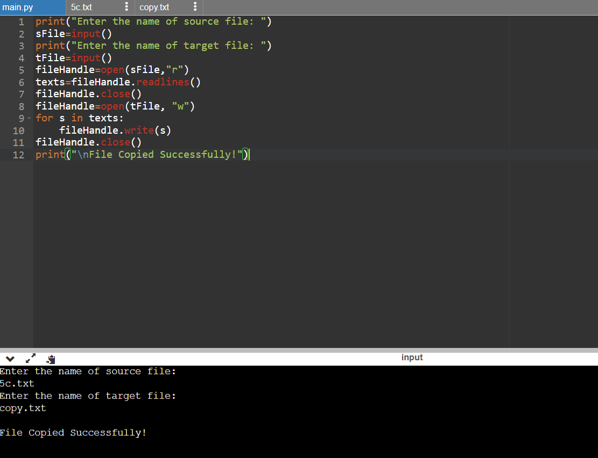

# copy-file
## AIM:
To write a python program for copying the contents from one file to another file.
## EQUIPEMENT'S REQUIRED: 
PC
Anaconda - Python 3.7
## ALGORITHM: 
### Step 1:
start the program
### Step 2: 
open the file 
### Step 3: 
copying the content form the file
### Step 4:  
end the program

## PROGRAM:
```
'''
#Program to copy the file.
#Developed by: VARNIKA.P
#RegisterNumber: 23008344
'''
print("Enter the name of source file: ")
sFile=input()
print("Enter the name of target file: ")
tFile=input()
fileHandle=open(sFile,"r")
texts=fileHandle.readlines()
fileHandle.close()
fileHandle=open(tFile, "w")
for s in texts:
    fileHandle.write(s)
fileHandle.close()
print("\nFile Copied Successfully!")

```
### OUTPUT:




## RESULT:
Thus the program is written to copy the contents from one file to another file.